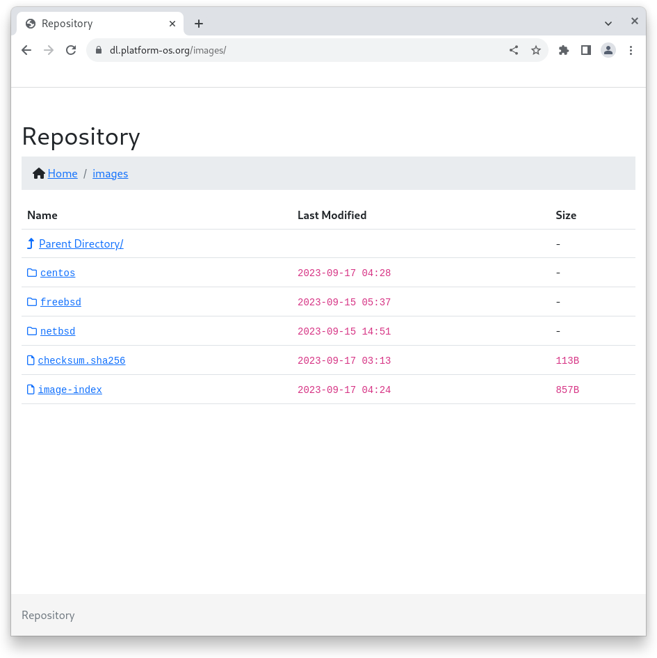

# dl
Nginx/Openresty configuration




## Install Nginx

**Rocky**

```shell
dnf install -y nginx nginx-mod-http-xslt-filter
```

**Debian**

```shell
apt install -y nginx libnginx-mod-http-xslt-filter
```

## Checksum Images

Verify file's SHA-256 checksum to check there's no malicious actor replacing the file or packets being lost.

1. In a command line, run the command:

```shell
sha256sum CentOS-6-x86_64-GenericCloud-1907.qcow2
```

The command line returns the file's checksum:

```
5350c20875a3fec28157abbc7db5dc635911212804f892b751f94fcf3f285aec  CentOS-6-x86_64-GenericCloud-1907.qcow2
```

2. Compare the value returned by the command line with the value from the sha256sum.txt

```
sha256sum -c checksum.sha256
```

The command will return:

```
CentOS-6-x86_64-GenericCloud-1907.qcow2: OK
```

or 

```
CentOS-6-x86_64-GenericCloud-1907.qcow2: FAILED
sha256sum: WARNING: 1 computed checksum did NOT match
```

## Contributors

* Moritz Wilhelmy [@wilhelmy](https://github.com/wilhelmy)
* Vyacheslav Anzhiganov [@vanzhiganov](https://github.com/vanzhiganov)
